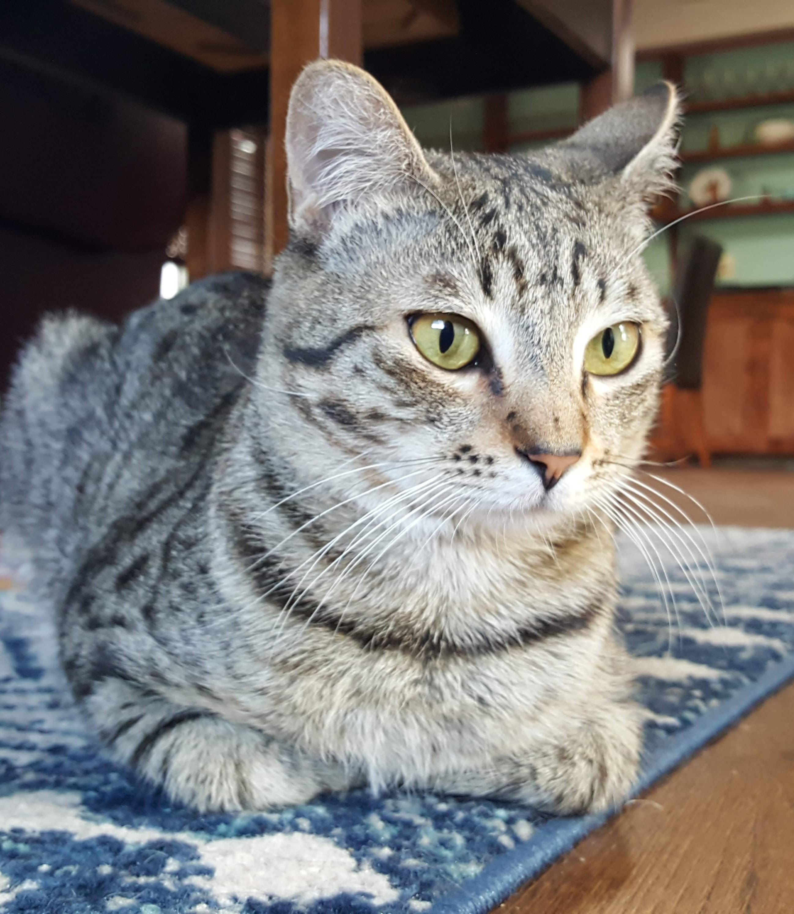

# Introduction {#paintByNumbers}

## Intro

This project aims to convert an image (e.g., of my cat) into paint-by-number instructions. This involves:

* reducing the number of colors down to a reasonable number, i.e. reducing the 16+ million colors possible with 8-bit images down to like 10-15,

* converting raster data into polygons based on those limited colors,

* saving those resulting polygons with their color IDs as printable and readable instructions,

This document follows the adventure of getting it all to work. The image we will start with is this one:

```{r out.width = "50%", fig.align="center", echo=FALSE}

```


## Packages being used

The packages we load are all on CRAN. *raster* has handy functions for handling and viewing images, *sf* and *smoothr* help with handling the polygons, and *tidyverse* has general grammar for tidy data manipulation. Disclaimer: there are probably more packages out there that do similar things, but I'm coming from a geospatial day job and I'm using these packages since there are already familiar to me. 

```{r message=FALSE}
library(raster)
library(sf)
library(tidyverse)
library(smoothr)
```

### Step 1: Reading in the image

```{r }
img <- brick("../images/byxbee_loaf.jpg") 
plotRGB(img)
```

### Step 2: Reducing the number of colors

##### Attempt 1: just rounding the individual RGB values

```{r}
cutoff <- 75  # number to rount to
rounded_img <- img  # make a copy of the orignal image object

values(rounded_img) <- values(img)  %>%  # extract values from image (strip spatial component)
  as_tibble() %>% #converting the matrix to tibble for tidy data manipulation
  mutate_all(~cutoff*floor(./cutoff)) %>% # overwrite all values to rounded down values to cutoff
  as.matrix() # convert back to matrix

plotRGB(rounded_img)
```

##### Attempt 2: using kmeans clustering 

##### Attempt 3: specifying a palette first

I haven't tried this yet, but the plan is to see if we can split the colors from the image into a pre-defined set of colors. Maybe cool ones like the [Wes Anderson pallete](https://github.com/karthik/wesanderson) or matching to paint sets to make painting the printed result more feasible. 

### Step 3: Reducing the number of colors